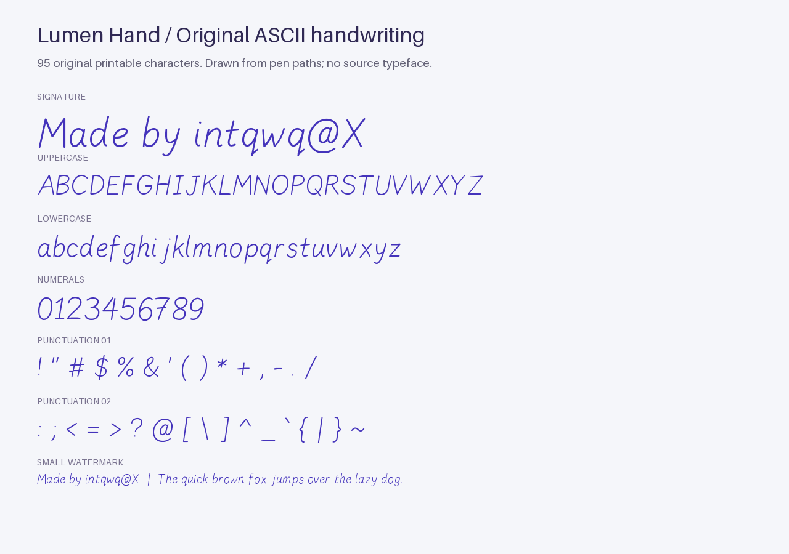
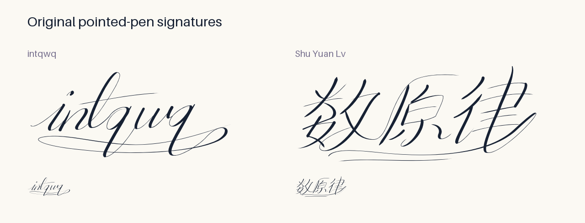

# Lumen Hand

An original, lightly slanted handwritten typeface made for Watermark Studio.
All 95 printable ASCII characters (U+0020 through U+007E) are drawn from the
pen paths in `build_font.py`: capitals, lowercase, digits, space and punctuation.
No outlines, tracings or letterforms from another font are imported.

Two additional, separately drawn word signatures are available as dedicated
presets: **intqwq** at U+E000 and **数原律** at U+E001. These are complete connected
pen designs, not sequences of the normal font's individual letters. The latter
is a signature for this specific name, not a general-purpose Chinese typeface.
The signature designs use pointed-pen contrast, looped ascenders and descenders,
and returning flourishes. Downstrokes carry pressure; upward joins stay fine.
The Chinese name uses compressed, connected radicals with a sweeping final stroke.
The app keeps the readable name in the input and uses the private-use glyph only
while drawing. Editing the name returns to regular handwriting.





The centerlines are expanded with gently varying pressure into closed outlines.
The checked-in TTF and WOFF2 files live in `dist/fonts/`; the application needs
no font-building libraries at runtime. Characters outside ASCII use the browser's
normal fallback font, including Chinese.

To rebuild with Python 3:

```sh
python -m pip install 'fonttools[woff]' shapely brotli
python fonts/build_font.py
```

The source and generated font files are included in this project so the original
design can be inspected and rebuilt.
